# Green Market App Structure Review

## Executive summary

The codebase has the right **technologies** for the PRD (Next.js App Router, Drizzle, better-auth, role dashboards), but the **folder structure and layering do not yet match** a maintainable marketplace MVP. The biggest risks are: **broken or bypassed route protection**, **insecure profile creation**, **duplicate/conflicting APIs and onboarding flows**, and **navigation pointing at routes that do not exist**.

You are also carrying **legacy CRA/Vite-era components** (`Product/`, `product/`, react-router imports) that add noise without powering any current page.

---

## Severity map

```mermaid
flowchart LR
  subgraph critical [Fix first]
    MW[middleware location]
    SEC[profile/create no auth]
    DUP[duplicate auth and product APIs]
    LAYOUT[no root layout + client html]
  end
  subgraph high [Next]
    GUARD[centralize session/role guards]
    ONBOARD[one onboarding flow]
    SCHEMA[align IDs and validation]
    DEAD[remove legacy components]
  end
  subgraph mvp [PRD MVP gaps]
    CART[cart + checkout]
    PDP[product detail page]
    SEARCH[search and filters]
    EXPERT[expert flows]
  end
  critical --> high --> mvp
```




---

## 1. Critical — broken foundations

### Middleware likely never runs

`[src/app/middleware.ts](src/app/middleware.ts)` is the **only** middleware file. Next.js expects middleware at `**src/middleware.ts`** or project-root `**middleware.ts`**, not under `app/`. Dashboard protection may be **page-only** today.

Additional issues inside that file:

- References `/signup` while the app uses `[/register](src/app/(auth)`/register/page.tsx)
- Auth-route redirect logic sits inside the `isProtected` branch, so it never runs for `/login`

**Change:** Move to `src/middleware.ts`, fix route names, protect `/dashboard` and optionally redirect authenticated users away from `/login` and `/register`.

### No root `app/layout.tsx` — two competing document shells

Both route groups define full `<html><body>`:

- `[src/app/(main)/layout.tsx](src/app/(main)`/layout.tsx) — `"use client"`, Material Tailwind `ThemeProvider`, `AppNavbar`, Footer
- `[src/app/(auth)/layout.tsx](src/app/(auth)`/layout.tsx) — `"use client"`, `AuthNavbar`, Footer

This violates App Router convention (one root layout) and causes:

- Inconsistent theming (`ThemeProvider` only on main routes)
- Layout remounts when switching `/` ↔ `/marketplace`
- Entire main segment forced client-side because the **layout** is `"use client"`

**Change:**

```
src/app/layout.tsx          # server: html, body, fonts, ThemeProvider, global CSS
src/app/(auth)/layout.tsx   # optional: pass-through or auth-specific chrome only
src/app/(main)/layout.tsx   # AppNavbar + Footer (prefer server wrapper + small client islands)
```

### Unauthenticated profile creation (security)

`[src/app/api/profile/create/route.ts](src/app/api/profile/create/route.ts)` accepts arbitrary `{ userId, role }` with **no session check**. `[signup-form.tsx](src/components/signup-form.tsx)` calls this after signup.

Anyone can assign roles to any user ID.

**Change:** Remove this route or require session + `userId === session.user.id`. Prefer a single `[/api/profile/setup](src/app/api/profile/setup/route.ts)` flow that also creates `seller_profiles` / `buyer_profiles` / `expert_profiles`.

### Duplicate product create APIs with schema mismatch


| Route                       | Fields                   | Used by                                                                         |
| --------------------------- | ------------------------ | ------------------------------------------------------------------------------- |
| `POST /api/products`        | `title`, `stockQuantity` | `[addProductForm.tsx](src/app/(main)`/dashboard/seller/addProductForm.tsx)      |
| `POST /api/products/create` | `name`, `quantity`       | `[seller/products/page.tsx](src/app/(main)`/dashboard/seller/products/page.tsx) |


DB schema (`[products.ts](src/db/schema/products.ts)`) uses `title` and `stockQuantity`. The `/create` route and products page form are **wrong**.

**Change:** Delete `/api/products/create` and the duplicate form; keep one canonical create path.

### Client component without `"use client"`

`[seller/products/page.tsx](src/app/(main)`/dashboard/seller/products/page.tsx) uses `useState` / `useRouter` but has no directive — likely a build/runtime error. `[products/new/page.tsx](src/app/(main)`/dashboard/seller/products/new/page.tsx) is **empty** while the create form lives on `/products`.

**Change:** One route: `/dashboard/seller/products/new` for create, `/dashboard/seller/products` for list; add `"use client"` only where needed.

---

## 2. High — architecture and consistency

### Auth: three parallel sign-up/sign-in paths

1. better-auth catch-all: `[api/auth/[...all]/route.ts](src/app/api/auth/[...all]/route.ts)`
2. Custom: `[api/auth/signin](src/app/api/auth/signin/route.ts)`, `[api/auth/signup](src/app/api/auth/signup/route.ts)` (signup route appears **unused** by UI)
3. Client: `[authClient](src/lib/auth/auth-client.ts)` in forms

`[login-form.tsx](src/components/login-form.tsx)` signs in twice (custom API + `authClient.signIn.email`).

**Change:** Use **only** better-auth client + `[...all]` handler. Delete custom signin/signup routes unless they add unique behavior.

### Onboarding: two divergent flows


| Flow                                 | Creates `profiles` | Creates role tables |
| ------------------------------------ | ------------------ | ------------------- |
| Register → `profile/create`          | Yes                | **No**              |
| `/dashboard/setup` → `profile/setup` | Yes                | **Yes**             |


Users who register with a role may skip role-specific tables until setup — inconsistent with PRD profile model.

**Change:** One flow: Register → Login → `/dashboard/setup` (if incomplete) → role dashboard. On register, do **not** insert profile via open API; let setup API handle everything.

### Role guards duplicated on every page

`[require-role.ts](src/lib/auth/require-role.ts)` and `[get-current-user.ts](src/lib/auth/get-current-user.ts)` are empty. Every dashboard page repeats:

```ts
const session = await auth.api.getSession({ headers: await headers() });
// profile lookup + role check + redirect
```

**Change:** Implement `requireSession()` and `requireRole("seller")` in `[src/lib/auth/](src/lib/auth/)` and add a shared `[src/app/(main)/dashboard/layout.tsx](src/app/(main)`/dashboard/layout.tsx) that enforces session + profile existence once.

Optional PRD-aligned route groups:

```
dashboard/
  (buyer)/buyer/...
  (seller)/seller/...   # layout checks seller role once
  (expert)/expert/...
```

### Zod schemas defined but unused

`[lib/validations/auth.ts](src/lib/validations/auth.ts)` allows only `buyer | seller` while UI supports **expert**. `[lib/validations/product.ts](src/lib/validations/product.ts)` uses `name` / `quantity` vs DB `title` / `stockQuantity`.

**Change:** Wire schemas in API routes and forms; align enums with PRD roles and DB columns.

### Data model identity inconsistency

- `products.sellerId` → **text** (auth `user.id`)
- `orders.buyerId` → **uuid** (`profiles.id`)

Orders cannot cleanly join products to buyers/sellers without ad-hoc mapping.

**Change (pick one model):**

- **A (recommended):** All foreign keys use `user.id` (text); role tables are extensions only.
- **B:** All commerce FKs use `profiles.id`; products must use `sellerId` → profile uuid.

Add Drizzle `relations()` for typed queries.

### Empty scaffolding creates false confidence

Empty or stub files: `src/services/*.service.ts`, `src/server/`*, `src/hooks/usecart.ts`, `api/orders`, `api/upload`, `api/profile/role`, `types/`*, duplicate `src/index.tsx` DB client.

**Change:** Delete unused stubs **or** implement them — do not keep both empty services and inline DB in routes.

### Navigation links to missing pages

`[nav-links.ts](src/components/navigation/nav-links.ts)` references `/cart`, `/account`, `/dashboard/seller/orders` — **no pages exist**. `SellerSidebar` exists but is **not wired** into seller layout.

**Change:** Either implement routes or remove links until MVP-ready. Wire seller sidebar in a `dashboard/seller/layout.tsx`.

### Dual UI stacks

Material Tailwind (`ThemeProvider` in main layout) + shadcn/Radix (`components/ui`) + dead Material/heroicons/react-router product cards.

**Change:** Standardize on **shadcn + Tailwind** for MVP; remove Material Tailwind unless you have a strong reason to keep both.

### Legacy duplicate component trees

`src/components/Product/` and `src/components/product/` — duplicate `ProductCard`, `FilterPanel`, `copy` folders; imports `react-router-dom`, `@heroicons/react`, `CartContext` — **not in package.json**, **not imported by app**.

**Change:** Delete legacy trees after extracting anything still useful.

---

## 3. PRD MVP gaps (structure-related)

Your PRD Phase 2–3 items that need **new routes/modules**, not just fixes:


| PRD requirement             | Current state                                                  |
| --------------------------- | -------------------------------------------------------------- |
| Product detail page         | No `/marketplace/[id]` or `/products/[id]`                     |
| Search and filter           | `search-bar.tsx` exists; no query/API wiring                   |
| Categories                  | Column exists; no filter UI on marketplace                     |
| Cart and orders             | `usecart.ts` empty; `api/orders` empty; no `/cart` page        |
| Expert profile and services | Expert dashboard is placeholder; no expert schema usage in app |
| Image upload                | `api/upload` empty; forms use URL text only                    |
| Seller order tracking       | Nav link only; no page                                         |
| Protected routes (PRD 7.1)  | Relies on broken/missing middleware + per-page checks          |


Recommended **route map** aligned with PRD:

```
/                          # marketing (public)
/login, /register          # auth (public)
/marketplace               # browse (public)
/marketplace/[productId]   # detail (public)
/cart                      # buyer (protected)
/dashboard                 # role hub (protected)
/dashboard/setup           # onboarding (protected)
/dashboard/buyer           # buyer dashboard
/dashboard/seller          # seller overview
/dashboard/seller/products
/dashboard/seller/products/new
/dashboard/seller/orders
/dashboard/expert
/api/auth/[...all]
/api/products, /api/products/[id]
/api/orders
/api/profile/setup
```

---

## 4. Recommended target structure

```text
src/
  app/
    layout.tsx                 # single root document
    middleware.ts              # at src/, not src/app/
    (marketing)/               # optional: /, about
    (auth)/login, register
    (shop)/
      marketplace/
      marketplace/[id]/
      cart/
    (dashboard)/
      layout.tsx               # session + profile gate
      setup/
      buyer/
      seller/
        layout.tsx             # seller role + sidebar
      expert/
    api/                       # thin handlers only
  components/
    ui/                        # shadcn primitives
    features/
      marketplace/
      seller/
      auth/
  lib/
    auth/                      # auth, session, require-role
    validations/
  server/                      # domain logic (preferred over empty services/)
    products.ts
    profiles.ts
    orders.ts
  db/
    schema/
    migrations/
```

**Layering rule:** Pages → call `server/`* functions → Drizzle. API routes only where you need REST (webhooks, external clients) or keep thin wrappers around the same server functions.

PRD mentions Server Actions — optional, but **pick one mutation style** (Server Actions *or* Route Handlers + `server/`*), not both duplicated.

---

## 5. Phased refactor plan (when you implement)

### Phase A — Safety and correctness (1–2 days)

- Move middleware to `src/middleware.ts`; fix `/register` vs `/signup`
- Add root `app/layout.tsx`; slim group layouts
- Secure/remove `profile/create`; unify onboarding on `profile/setup`
- Single product API; fix seller products routes and `"use client"`
- Implement `requireSession` / `requireRole`; `dashboard/layout.tsx`

### Phase B — Cleanup (1 day)

- Delete legacy `Product/` + `product/` trees and unused `src/index.tsx`
- Remove duplicate auth routes and dual login/signup calls
- Wire Zod validations; align expert in `registerSchema`
- Remove nav links to unbuilt routes or stub pages with "Coming soon"
- Wire `SellerSidebar` in seller layout

### Phase C — PRD MVP completion (feature work)

- Product detail page + marketplace search/filter
- Cart state (`useCart` or server cart) + `orders` API + checkout flow
- Expert profile CRUD and service listings
- Image upload route + storage (Supabase Storage fits your stack)
- Product states: Active / Out of Stock / Archived (add `status` column + UI)

### Phase D — Data model hardening

- Unify ID strategy across `products`, `orders`, `profiles`
- Add Drizzle relations; optional FK from `profiles.userId` → `user.id`

---

## 6. What is actually good (keep)

- **Route groups** `(auth)` vs `(main)` — reasonable split once root layout exists
- **Hub-and-spoke** `[/dashboard](src/app/(main)`/dashboard/page.tsx) role router matches PRD user flow
- **Centralized nav config** `[nav-links.ts](src/components/navigation/nav-links.ts)` and `[app-navbar.tsx](src/components/navigation/app-navbar.tsx)` — right direction
- **better-auth + Drizzle adapter** — correct stack choice
- **Server-rendered marketplace listing** — good pattern for performance
- **Role-specific profile tables** in schema — matches PRD §10

---

## 7. Priority checklist


| Priority | Issue                            | Action                             |
| -------- | -------------------------------- | ---------------------------------- |
| P0       | Middleware in wrong path         | Move to `src/middleware.ts`        |
| P0       | Open `profile/create`            | Auth-gate or delete                |
| P0       | Duplicate/wrong product API      | One route, one form                |
| P0       | No root layout + client `<html>` | Add `app/layout.tsx`, server-first |
| P1       | Triple auth paths                | better-auth only                   |
| P1       | Dual onboarding                  | Single setup flow                  |
| P1       | Empty stubs + legacy folders     | Delete or implement                |
| P1       | Nav → 404 routes                 | Implement or remove                |
| P2       | PRD cart/PDP/search/expert       | New feature routes                 |
| P2       | ID model mismatch                | Schema migration                   |
| P2       | Unused Zod + services            | Wire or remove                     |


---

## Bottom line

The project is **not poorly conceived** — the PRD stack and role-based dashboard idea fit the domain. What needs to change is **consolidation**: one layout, one auth path, one onboarding path, one product API, real middleware, and deletion of legacy/empty layers before building cart, orders, and expert features on top.

Without Phase A, new MVP features will inherit the same bugs (wrong APIs, missing protection, inconsistent profiles).