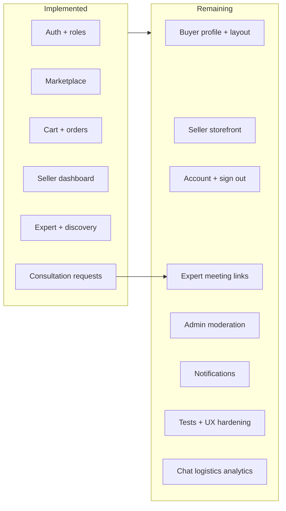
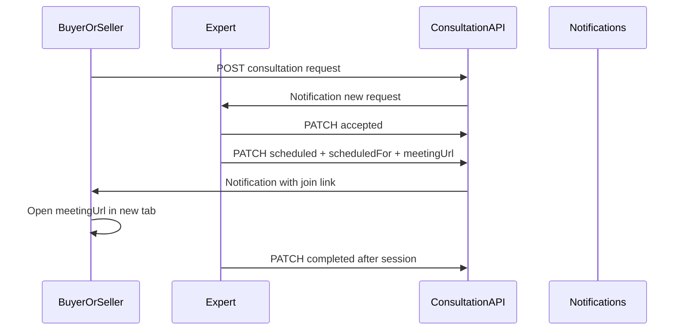
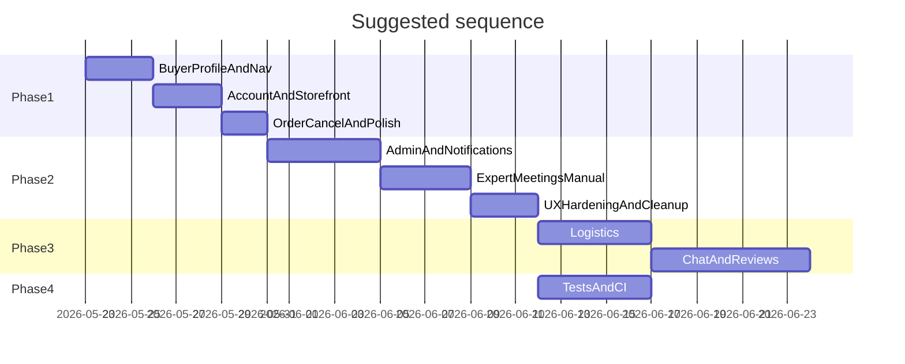

# Remaining Features Roadmap — Green Market

## Current state (baseline)

Core marketplace loop is **working**: auth, role onboarding, marketplace browse/search/filter, cart, orders with stock decrement, seller product CRUD + profile + orders, expert services + consultation requests + public `/experts`, Supabase/local image uploads, mobile seller/expert nav.

**Payments:** deferred (no gateway in this roadmap). Orders stay `pending` until seller confirms — document that clearly in checkout UI.

---

## Phase 1 — Complete PRD MVP gaps (highest priority)

Goal: Close functional holes in the original PRD without new product lines.

### 1.1 Buyer profile (schema exists, no UI)

- **API:** `GET/PUT /api/profile/buyer` mirroring `[api/profile/seller/route.ts](src/app/api/profile/seller/route.ts)`
- **Validation:** `[lib/validations/buyer-profile.ts](src/lib/validations/buyer-profile.ts)` — `businessName`, `businessType`
- **Page:** `/dashboard/buyer/profile` with responsive form
- **Nav:** buyer mobile tab bar + optional link from `[dashboard/buyer/page.tsx](src/app/(main)`/dashboard/buyer/page.tsx)

### 1.2 Buyer dashboard layout and navigation

- **Layout:** `[dashboard/buyer/layout.tsx](src/app/(main)`/dashboard/buyer/layout.tsx) with `requireRole("buyer")`
- **Mobile:** horizontal tabs (Overview, Profile, Marketplace, Experts) — same pattern as `[seller-mobile-nav.tsx](src/components/navigation/seller/seller-mobile-nav.tsx)`
- **Navbar:** extend `[app-navbar.tsx](src/components/navigation/app-navbar.tsx)` with `BuyerNavbar` when path starts with `/dashboard/buyer`

### 1.3 Account / session UX (PRD “profile management”)

- **Page:** `/account` — show name, email, role; link to role dashboard
- **Component:** wire `[user-menu.tsx](src/components/navigation/shared/user-menu.tsx)` with session from `authClient` / server session + **Sign out** via better-auth
- **Fix links:** login “Sign up” → `/register` (currently `href="#"` in `[login-form.tsx](src/components/login-form.tsx)`)

### 1.4 Seller public storefront

- **Route:** `/sellers/[sellerId]` — farm name, location, verification badge, grid of **active** products only
- **Data:** query `sellerProfiles` + `products` where `sellerId = userId` and `status != archived`
- **PDP link:** “View all from this seller” on `[marketplace/[productId]/page.tsx](src/app/(main)`/marketplace/[productId]/page.tsx)

### 1.5 Buyer order actions

- **API:** extend `[api/orders/[orderId]/route.ts](src/app/api/orders/[orderId]/route.ts)` — buyer can `PATCH` to `cancelled` when status is `pending` (reuse `[canTransitionOrderStatus](src/lib/orders.ts)`)
- **UI:** cancel button on buyer order cards in `[dashboard/buyer/page.tsx](src/app/(main)`/dashboard/buyer/page.tsx)

### 1.6 Seller consultation requests inbox

- API already returns seller rows from `[api/consultation-requests/route.ts](src/app/api/consultation-requests/route.ts)`
- **Page or section:** `/dashboard/seller/requests` (or tab on overview) — list requests for experts’ services booked by buyers (if sellers can book experts, show their own outbound requests too)

### 1.7 Marketplace listing polish

- **Filter:** exclude `out_of_stock` from public browse in `[getPublicProducts](src/lib/products.ts)` (or show with badge but sort last — recommend hide for cleaner MVP)
- **Checkout copy:** on `[cart/page.tsx](src/app/(main)`/cart/page.tsx) — “No online payment yet. Seller will confirm your order.”

### 1.8 Onboarding UX

- **Signup → setup:** pass role once — either include role in setup only (remove redundant picker) or auto-submit setup after signup using `sessionStorage` role from `[signup-form.tsx](src/components/signup-form.tsx)`
- **Setup UI:** replace minimal `[setupform.tsx](src/app/(main)`/dashboard/setup/setupform.tsx) with card layout matching seller profile form

**Phase 1 exit criteria:** All three roles have profile edit + sensible mobile nav; buyers can cancel pending orders; sellers have a public page; account menu works.

---

## Phase 2 — Platform hardening and ops (pre-launch)

Goal: Trust, safety, and maintainability before real users.

### 2.1 Route protection

- Confirm `[src/proxy.ts](src/proxy.ts)` is active (Next.js 16 proxy) or add equivalent; protect `/cart` checkout for authenticated buyers only if desired
- Optional: redirect unauthenticated `/dashboard/`* at edge (cookie check already in proxy)

### 2.2 Admin role and moderation (PRD admins)

- **Schema:** `profiles.role = 'admin'` or separate `admins` table; migration
- **Routes:** `/dashboard/admin` — users list, seller verification (`verificationStatus`: pending → verified/rejected), product flag/archive
- **API:** `PATCH /api/admin/sellers/[userId]/verification`, `GET /api/admin/products` (reported queue can be Phase 3)
- **Guard:** `requireRole("admin")` in admin layout

### 2.3 Notifications (in-app first)

- **Schema:** `notifications` table — `userId`, `type`, `title`, `body`, `readAt`, `metadata` (orderId, requestId)
- **Emit on:** order created (seller), order status change (buyer), consultation request created (expert), status change (requester)
- **API:** `GET /api/notifications`, `PATCH` mark read
- **UI:** replace stub `[notifications.tsx](src/components/navigation/shared/notifications.tsx)` with dropdown + unread count

### 2.4 Email (optional but high value)

- Use Resend/SendGrid + better-auth hooks for: welcome, order placed, consultation request received
- Env vars in `[.env.example](.env.example)`

### 2.5 UX and error handling (Phase 4 PRD)

- Replace `alert()` with **Sonner** toasts (already in `package.json`)
- Add `error.tsx` + `loading.tsx` for `(main)` and dashboard segments
- Add `not-found.tsx` for marketplace product / expert service
- Shared `PageHeader` component for consistent mobile typography

### 2.6 Code cleanup

- Delete unused `[addProductForm.tsx](src/app/(main)`/dashboard/seller/addProductForm.tsx), `[sellerProducts.tsx](src/app/(main)`/dashboard/seller/sellerProducts.tsx)
- Add Zod schema for expert service create (align `[api/expert-services/route.ts](src/app/api/expert-services/route.ts)`)
- Expert discovery: search/filter on `[/experts](src/app/(main)`/experts/page.tsx) (expertise, price range)

### 2.7 Supabase Storage production checklist

- Document bucket policy + public URL in README or `.env.example` (already started)
- Add upload error messaging when Supabase env missing in production (`NODE_ENV=production` → warn if falling back to local disk)

**Phase 2 exit criteria:** Admin can verify sellers; users see in-app notifications; fewer dead ends in UI; cleaner codebase.

---

## Phase 2.8 — Expert consultation meetings (manual links)

**Approach:** Manual meeting links only — experts paste a **Google Meet, Zoom, or phone** link when scheduling. No embedded video (Daily/Jitsi) in this roadmap. Fits Ghana connectivity realities and avoids extra vendor cost/complexity.

### Current gap

| Exists today | Missing |
|--------------|---------|
| Request lifecycle: `pending` → `accepted` → `scheduled` → `completed` | No `meetingUrl` on [`consultation_requests`](src/db/schema/consultation-requests.ts) |
| `scheduledFor` datetime on schedule | No validated URL, no “Join meeting” UI for requester |
| Expert sets time via [`expert-requests-inbox.tsx`](src/components/expert/expert-requests-inbox.tsx) | Buyer/seller only see status text on [`dashboard/buyer/page.tsx`](src/app/(main)/dashboard/buyer/page.tsx) — no join CTA |
| PATCH in [`api/consultation-requests/[requestId]/route.ts`](src/app/api/consultation-requests/[requestId]/route.ts) | Scheduling can succeed **without** a meeting link |

### 2.8.1 Schema migration

Extend [`consultation_requests`](src/db/schema/consultation-requests.ts):

| Column | Type | Purpose |
|--------|------|---------|
| `meetingUrl` | `text` nullable | Full HTTPS link to Meet/Zoom/etc. |
| `meetingNotes` | `text` nullable | Optional dial-in instructions, agenda |
| `meetingProvider` | `text` nullable | `google_meet` \| `zoom` \| `other` (parsed from URL or expert pick) |

**Rule:** Transition to `scheduled` requires **both** `scheduledFor` and valid `meetingUrl` (enforce in API + Zod).

Migration file: `src/db/migrations/0012_consultation_meeting.sql`

### 2.8.2 API changes

**[`PATCH /api/consultation-requests/[requestId]`](src/app/api/consultation-requests/[requestId]/route.ts)**

- When `status === "scheduled"`, require body:
  - `scheduledFor` (ISO datetime, must be in the future)
  - `meetingUrl` (valid `https://` URL; allowlist hosts optional: `meet.google.com`, `zoom.us`, `teams.microsoft.com`)
  - Optional `meetingNotes`, `meetingProvider`
- Reject schedule if URL missing or invalid
- On successful schedule: emit notification to requester (use existing [`lib/notifications.ts`](src/lib/notifications.ts) if present)

**New: `GET /api/consultation-requests/[requestId]/meeting`**

- Returns `{ scheduledFor, meetingUrl, meetingNotes, service, expert, requester, status }` for authorized expert or requester only
- **Do not** expose `meetingUrl` in list endpoints until status is `scheduled` (privacy)

**Optional: `PATCH` to update meeting link** while `scheduled` and before `scheduledFor` (expert only) — reschedule flow

Validation: [`lib/validations/consultation-meeting.ts`](src/lib/validations/consultation-meeting.ts)

### 2.8.3 Expert UI (mobile-responsive)

**Upgrade [`expert-requests-inbox.tsx`](src/components/expert/expert-requests-inbox.tsx)** — replace bare `datetime-local` + Schedule with a **Schedule consultation** panel:

- Date/time picker (full width on mobile)
- **Meeting link** input (required) with placeholder `https://meet.google.com/...`
- Optional provider select + notes textarea
- Primary button: “Schedule & send link”
- After `scheduled`: show **Copy link**, **Open meeting** (external `target="_blank"`), **Mark completed**

**New detail route (recommended):** `/dashboard/expert/requests/[requestId]`

- Full request context + schedule form on one screen (better on phones than cramped cards)
- Link from inbox cards

### 2.8.4 Requester UI (buyer + seller)

**Consultation detail:** `/consultations/[requestId]` (authenticated)

- Service title, expert name, status timeline
- When `scheduled`: prominent **Join consultation** button → `meetingUrl` (mobile: `h-12 w-full`, opens external app/browser)
- Show `scheduledFor` in user-local timezone with countdown (“Starts in 2 hours”) via client component
- Display `meetingNotes` if set
- **Cancel** while `pending` or `accepted` (existing PATCH rules)

**Dashboard integration:**

- [`dashboard/buyer/page.tsx`](src/app/(main)/dashboard/buyer/page.tsx) — add Join button on scheduled rows
- **Seller:** `/dashboard/seller/requests` (Phase 1.6) — same join pattern for outbound expert bookings

### 2.8.5 Notifications and email (tie to Phase 2.3–2.4)

| Event | Recipient | Payload |
|-------|-----------|---------|
| Request scheduled | Requester | Title, time, **meetingUrl** in metadata + in-app link to `/consultations/[id]` |
| Request accepted | Requester | “Expert accepted — awaiting schedule” |
| 24h / 1h reminder | Both | Optional cron (Phase 2.4 email) — “Your consultation starts soon” + link |

In-app notification click → consultation detail page (not raw URL in DB leak to wrong user).

### 2.8.6 Security and UX rules

- Only **expert** and **requester** may read `meetingUrl`
- Validate URLs server-side; block `javascript:` and non-HTTPS in production
- Expert cannot mark `completed` unless status was `scheduled` and `scheduledFor` is in the past (optional soft check with override)
- **Mobile:** external links use `rel="noopener noreferrer"`; large tap targets (min 44px)

### 2.8.7 Expert service page copy

Update [`experts/[serviceId]/page.tsx`](src/app/(main)/experts/[serviceId]/page.tsx) after booking success:

- “The expert will send a meeting link once your time is confirmed.”

### 2.8.8 Testing (Phase 4 overlap)

- Unit: schedule validation rejects missing URL / past dates
- E2E: expert schedules with Meet URL → requester sees Join button → link href matches

### 2.8.9 Out of scope (this epic)

- Embedded WebRTC / Daily.co / Jitsi rooms
- Calendar sync (Google Calendar API)
- Automatic Meet link generation via Google API
- Consultation payments (separate from marketplace orders)

**Phase 2.8 exit criteria:** Expert cannot schedule without a link; requester gets notification and one-tap Join on mobile; full flow documented in UI copy.

---

## Phase 3 — Post-MVP product features (PRD “Future Enhancements”)

Deferred until Phase 1–2 ship. Ordered by dependency and user value for Ghana ag marketplace context.

| Feature                     | Scope                                                                     | Key work                                                             |
| --------------------------- | ------------------------------------------------------------------------- | -------------------------------------------------------------------- |
| **Payments**                | Deferred by choice                                                        | Paystack/Stripe, `paid` order status, webhooks — separate epic later |
| **Delivery / logistics**    | Shipping address on orders, seller marks shippedf, optional tracking field | Extend `orders` schema, buyer checkout address form                  |
| **In-app video meetings**   | Embedded rooms for consultations                                          | Daily.co / Jitsi — only if manual links prove insufficient           |
| **Real-time chat**          | Buyer–seller threads; expert–client threads                               | New `conversations` + `messages` tables, Supabase Realtime or Pusher |
| **Reviews & ratings**       | Product and seller reviews after fulfilled orders                         | `reviews` table, post-order prompt                                   |
| **Analytics dashboard**     | Seller revenue charts, expert booking stats                               | Aggregate queries + chart component                                  |
| **AI recommendations**      | Product suggestions                                                       | External API + embedding search — lowest priority                    |
| **Mobile app**              | React Native / Expo                                                       | Out of web scope                                                     |
| **Blockchain traceability** | QR provenance                                                             | Out of scope unless product pivot                                    |

### 3.1 Logistics (recommended first post-MVP)

- `orders.shippingAddress`, `orders.fulfillmentStatus`
- Seller UI: mark shipped / delivered
- Buyer UI: track status timeline

### 3.2 Messaging

- Thread per order or per consultation request
- Unread counts tie into Phase 2 notifications

### 3.3 Reviews

- One review per order line or per order
- Display on PDP and seller storefront

---

## Phase 4 — Quality and release

| Item              | Approach                                                                                        |
| ----------------- | ----------------------------------------------------------------------------------------------- |
| **Unit tests**    | Vitest for `lib/orders.ts`, `lib/consultation-requests.ts`, `lib/product-utils.ts`              |
| **API tests**     | Route handler tests with mocked db or test DB                                                   |
| **E2E**           | Playwright: register → setup → list product → browse → cart → checkout                          |
| **CI**            | GitHub Actions: lint, build, test on PR                                                         |
| **Performance**   | Marketplace pagination (`limit`/`offset`), DB indexes on `products.category`, `products.status` |
| **Accessibility** | Focus traps in mobile drawers, form labels audit                                                |

---

## Suggested implementation order (sprints)

**Sprint 1 (Week 1):** Phase 1.1–1.5 — buyer profile, buyer nav, account menu, seller storefront, order cancel  
**Sprint 2 (Week 2):** Phase 1.6–1.8 + Phase 2.1–2.3 — onboarding, admin, notifications  
**Sprint 2b (Week 2–3):** **Phase 2.8** — consultation meeting links, schedule UI, requester join page (after notifications so schedule events notify)  
**Sprint 3 (Week 3):** Phase 2.4–2.7 + Phase 4 baseline — email reminders for meetings, toasts, tests, cleanup  
**Sprint 4+:** Phase 3 logistics → chat → reviews; payments epic when ready  

---

## Files likely touched (Phase 1 quick reference)

| Feature       | New / main files                                                                                            |
| ------------- | ----------------------------------------------------------------------------------------------------------- |
| Buyer profile | `api/profile/buyer/route.ts`, `dashboard/buyer/profile/page.tsx`, `components/buyer/buyer-profile-form.tsx` |
| Buyer nav     | `dashboard/buyer/layout.tsx`, `components/navigation/buyer/`*                                               |
| Account       | `app/(main)/account/page.tsx`, `components/navigation/shared/user-menu.tsx`                                 |
| Storefront    | `app/(main)/sellers/[sellerId]/page.tsx`, `lib/sellers.ts`                                                  |
| Order cancel  | `api/orders/[orderId]/route.ts`, buyer dashboard UI                                                         |
| Expert meetings | `0012_consultation_meeting.sql`, `lib/validations/consultation-meeting.ts`, `consultations/[requestId]/page.tsx`, expert request detail + inbox updates |

---

## Out of scope for this roadmap

- Payment gateway integration (deferred)
- Native mobile app
- AI / blockchain features
- Crowdfunding, auctions

When you are ready to implement, start with **Phase 1.1–1.5** in Agent mode — highest user-visible impact with lowest schema risk.